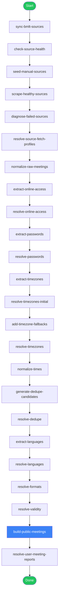
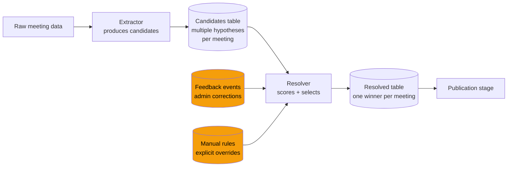
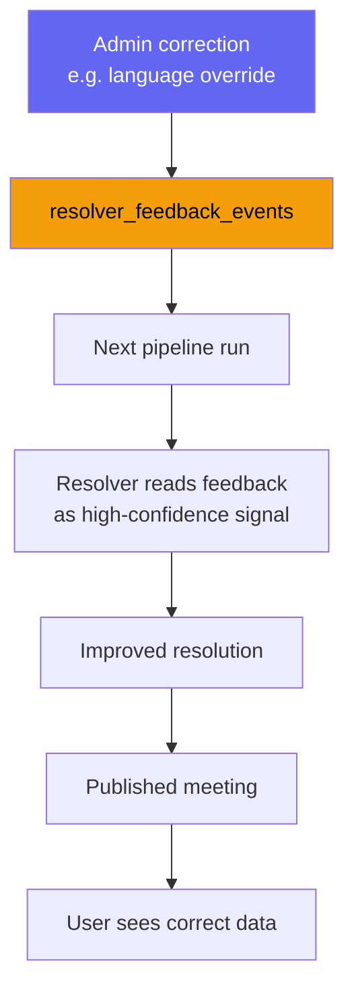
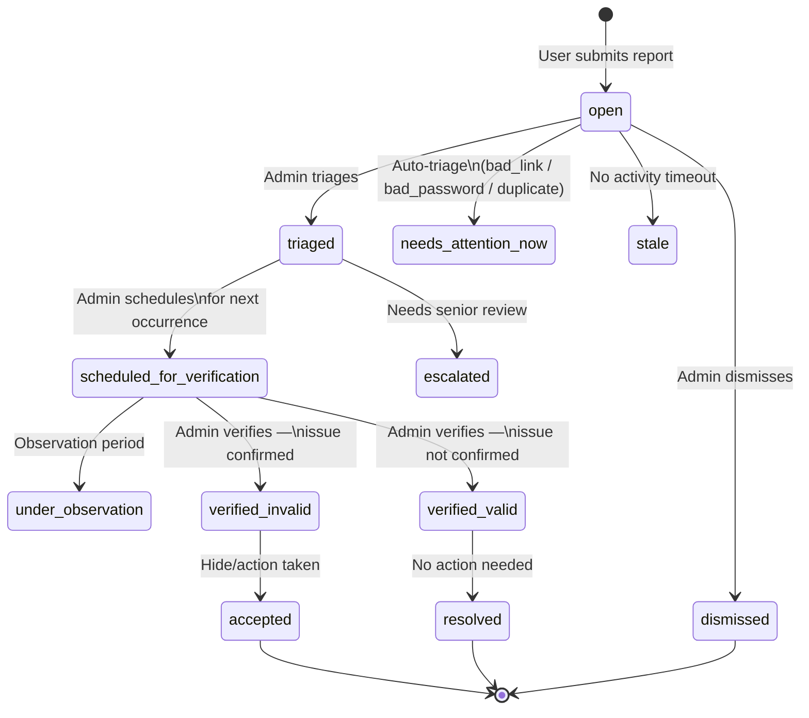

# NA Meetings Cloud

A global online meeting aggregation platform for Narcotics Anonymous, built to reliably collect, normalize, deduplicate, quality-score, and publish meeting data from 40+ independent sources worldwide.

> **Stack:** Node.js · MariaDB · Next.js 14 · Tailwind CSS · PM2

---

## Table of Contents

1. [Project Overview](#project-overview)
2. [Architecture Overview](#architecture-overview)
3. [Pipeline Stages](#pipeline-stages)
4. [Resolver Systems](#resolver-systems)
5. [Quality & Safety Systems](#quality--safety-systems)
6. [Moderation & Reporting](#moderation--reporting)
7. [Operational Design](#operational-design)
8. [Technical Challenges](#technical-challenges)
9. [Example Data Flow](#example-data-flow)
10. [Apps & APIs](#apps--apis)
11. [Running the Pipeline](#running-the-pipeline)
12. [Database Migrations](#database-migrations)
13. [Roadmap](#roadmap)

---

## Project Overview

NA Meetings Cloud aggregates online Narcotics Anonymous meeting data from **40+ BMLT (Basic Meeting List Toolbox) service bodies** and custom sources. Each source independently manages its own meeting schedule, using inconsistent formats, timezones, and access link conventions.

The platform solves the hard problem of turning fragmented, inconsistent, sometimes malformed source data into a clean, reliable, deduplicated meeting directory that users can trust.

Key capabilities:

- Fetches raw meeting data from BMLT JSON APIs and manual sources
- Normalizes inconsistent field formats and encodings
- Resolves timezones, language codes, online access URLs, and Zoom/Meet passwords
- Detects and resolves duplicate meetings that appear across multiple service bodies
- Scores each meeting's data quality before publication
- Applies staged publication safety gates to prevent mass data corruption
- Maintains a moderation and user reporting system with a scheduled verification workflow
- Tracks link health for all published meeting URLs
- Provides admin tooling for quality review, override management, and pipeline monitoring

---

## Architecture Overview

Three Next.js applications share a single MariaDB database. A pipeline of Node.js scripts processes raw source data into the public meetings table. The apps run under PM2 in production.

```
┌─────────────────────────────────────────────────────────────────┐
│                         BMLT Sources (40+)                      │
│         https://bmlt.*.org/main_server/client_interface/json    │
└──────────────────────────┬──────────────────────────────────────┘
                           │  HTTP fetch
                           ▼
┌─────────────────────────────────────────────────────────────────┐
│                    Data Pipeline (Node.js .cjs)                 │
│   sync → scrape → normalize → resolve → dedupe → score → publish│
└──────────────────────────┬──────────────────────────────────────┘
                           │  MariaDB
              ┌────────────┼────────────────┐
              ▼            ▼                ▼
      ┌──────────────┐ ┌──────────────┐ ┌──────────────┐
      │   meetings   │ │    admin     │ │    users     │
      │  (port 3000) │ │  (port 3001) │ │  (port 3002) │
      │  public dir  │ │  admin UI    │ │  user portal │
      └──────────────┘ └──────────────┘ └──────────────┘
```

### Database layout (key tables)

| Table | Purpose |
|---|---|
| `scraped_source_urls` | BMLT source registry with health status |
| `raw_source_meetings` | Unprocessed meeting data from scrapers |
| `normalized_source_meetings` | Cleaned, field-mapped meeting records |
| `resolved_meeting_timezones` | Timezone resolution results |
| `resolved_meeting_languages` | Language detection results |
| `resolved_online_access` | Extracted and validated access URLs |
| `resolved_access_passwords` | Extracted meeting passwords |
| `dedupe_candidate_groups` | Potential duplicate meeting clusters |
| `resolved_meeting_groups` | Dedupe decisions |
| `public_meetings` | Active published meetings (internal) |
| `public_meetings_staging` | Candidate dataset awaiting safety gate |
| `public_meetings_published` | Externally visible dataset |
| `pipeline_runs` | Pipeline execution history |
| `pipeline_step_runs` | Per-step timing and status |
| `user_meeting_reports` | User-submitted meeting reports |
| `meeting_link_checks` | Link health verification results |
| `resolver_feedback_events` | Admin corrections feeding back into resolvers |
| `admin_meeting_overrides` | Per-meeting admin visibility/language overrides |

---

## Pipeline Stages



### Stage reference

| Stage | Inputs | Outputs | Why it exists |
|---|---|---|---|
| **sync-bmlt-sources** | BMLT aggregator API | `scraped_source_urls` | Discovers new service bodies automatically |
| **check-source-health** | Each source URL | Health status per source | Prevents wasted scrape time on dead endpoints |
| **scrape-healthy-sources** | Healthy source URLs | `raw_source_meetings` | Fetches current meeting data from each source |
| **diagnose-failed-sources** | Failed scrape runs | Diagnostic notes | Identifies transient vs. permanent failures |
| **resolve-source-fetch-profiles** | Diagnostic data | Preferred fetch strategy per source | Adapts to sources requiring different headers/retry profiles |
| **normalize-raw-meetings** | Raw BMLT JSON fields | `normalized_source_meetings` | Maps inconsistent BMLT field names to a canonical schema |
| **extract-online-access** | Normalized meetings | `online_access_candidates` | Finds all plausible access URLs across free-text fields |
| **resolve-online-access** | Access candidates | `resolved_online_access` | Selects the best URL, classifies platform (Zoom/Meet/etc.) |
| **extract-passwords** | Multiple fields | `access_password_candidates` | Extracts meeting passwords from comments, descriptions |
| **resolve-passwords** | Password candidates | `resolved_access_passwords` | Deduplicates and validates password candidates |
| **extract-timezones** | Location, source metadata | `timezone_candidates` | Generates timezone hypotheses from multiple signals |
| **resolve-timezones** (×2) | Timezone candidates | `resolved_meeting_timezones` | Selects the most confident timezone with fallback pass |
| **add-timezone-fallbacks** | Unresolved meetings | Additional candidates | Adds geo-lookup and manual rule candidates for hard cases |
| **normalize-times** | Resolved timezones | `time_normalized_meetings` | Converts local times to UTC for the public API |
| **generate-dedupe-candidates** | Normalized meetings | `dedupe_candidate_groups` | Clusters meetings likely to be the same event |
| **resolve-dedupe** | Candidate groups | `resolved_meeting_groups` | Selects canonical meeting per cluster |
| **extract-languages** | Names, descriptions | `language_candidates` | Scores language hypotheses using CLD3 and franc |
| **resolve-languages** | Language candidates | `resolved_meeting_languages` | Selects the most confident language code |
| **resolve-formats** | Raw format codes | `resolved_meeting_formats` | Maps BMLT format codes to human-readable labels |
| **resolve-validity** | All resolved data | `resolved_meeting_validity` | Flags meetings with missing critical data |
| **build-public-meetings** | All resolver outputs | `public_meetings`, `public_meetings_staging` | Final assembly and publication safety gate |
| **resolve-user-meeting-reports** | Pipeline output diff | `user_meeting_reports` | Auto-closes reports when source data fixes the underlying issue |

---

## Resolver Systems

Each resolver follows a **candidate-then-resolution** pattern:



**Timezone resolver** — combines signals from:
- BMLT `time_zone` field
- Reverse geo-lookup from lat/lng
- Manual timezone rules (keyword-matched)
- Admin override feedback events

**Language resolver** — combines:
- CLD3 (Google's language detection WASM model)
- franc (n-gram based detector)
- ISO language code from source BMLT field
- Admin corrections via feedback events

**Online access resolver** — handles:
- Zoom meeting URLs and IDs
- Google Meet links
- Microsoft Teams links
- Phone numbers and bridge lines
- Jitsi and custom platforms
- Password extraction from adjacent fields

**Deduplication resolver** — groups meetings by:
- Matching Zoom meeting ID
- Matching meeting name + weekday + start time within ±30 min
- Geographic proximity (for hybrid meetings)

Feedback from admin corrections is stored in `resolver_feedback_events` and applied during the next pipeline run, creating a continuous improvement loop.



---

## Quality & Safety Systems

### Publication safety gate

The pipeline never writes directly to `public_meetings`. It builds a staging dataset first (`public_meetings_staging`) and then runs a safety gate before promotion.

```mermaid
flowchart TD
    BUILD[build-public-meetings] --> STAGE[(public_meetings_staging)]
    STAGE --> GATE{Safety gate}
    GATE -- Pass --> BACKUP[Backup current public_meetings]
    BACKUP --> PROMOTE[Promote staging → public_meetings_published]
    PROMOTE --> DONE([Published])
    GATE -- Fail: count regression > threshold --> HALT([Pipeline halted\noperator must review])
    GATE -- Fail: too many format errors --> HALT
    GATE -- --force-publish flag --> PROMOTE

    style GATE fill:#ef4444,color:#fff
    style HALT fill:#dc2626,color:#fff
    style DONE fill:#22c55e,color:#fff
```

The gate rejects promotion when:
- The new dataset has significantly fewer meetings than the current one (regression guard)
- A suspiciously high proportion of meetings have unresolved timezones
- A suspiciously high proportion of meetings have no access URL

### Quality metrics

After every pipeline run, `collectPipelineQualityMetrics()` records:

| Metric | What it measures |
|---|---|
| `timezone_resolution_rate` | % of meetings with a resolved timezone |
| `language_resolution_rate` | % of meetings with a resolved language |
| `online_access_resolution_rate` | % of online meetings with a valid access URL |
| `dedupe_rate` | % of raw meetings identified as duplicates |
| `canonical_rate` | % of published meetings marked canonical |
| `link_check_ok_rate` | % of published URLs passing HEAD check |

### Link health checking

`checkLinkHealth.cjs` runs as a separate scheduled job (outside the main pipeline). It issues polite HEAD requests to every `online_access_url`, rate-limited at ≥1500 ms between requests, with a 10-second timeout per check. Results feed:

- The `meeting_link_checks` table
- Auto-triage of `bad_link` reports
- Quality score signals on public meetings

---

## Moderation & Reporting

### Report lifecycle



### Verification schedule

Because many reports concern **time-based issues** (host never arrived, no attendants, wrong timezone), they cannot be verified until the meeting occurs again. The admin Reports tab organises these into a verification calendar:

```mermaid
gantt
    title Verification schedule (example)
    dateFormat  HH:mm
    axisFormat  %H:%M

    section Needs attention now
    bad_link report        :crit, 00:00, 1h
    bad_password report    :crit, 00:00, 1h

    section Today
    "No attendants" — 19:00 meeting    : 19:00, 1h

    section Tomorrow
    "Host never arrived" — 18:30 meeting : 18:30, 1h

    section This week
    "Wrong language" — Thursday 20:00   : 48h, 1h
```

### Confidence scoring

Each report carries a `confidence_score` (0–1) computed from:
- Number of corroborating reports for the same meeting
- Reporter's historical accuracy (future enhancement)

Reports with high confidence scores surface first in the admin queue.

---

## Operational Design

### Why staging tables exist

Writing directly to the live table risks exposing incomplete or corrupted data mid-pipeline. Staging tables isolate the in-progress dataset from the public-facing one. The promotion step is atomic (a rename operation), so users either see the old complete dataset or the new complete dataset — never a partial one.

### Why safety gates exist

Pipeline bugs, source-side data corruption, or a misbehaving scraper could silently delete large fractions of the meeting catalogue. The safety gate catches these cases before they affect users by comparing the candidate dataset against known-good thresholds. A forced-publish option exists for genuine intentional regressions.

### Why resolver feedback matters

No automated resolver is 100% accurate. When an admin corrects a language, timezone, or access URL, that correction is stored as a `resolver_feedback_event`. The resolver reads these on the next run and treats admin corrections as the highest-confidence signal, overriding automated guesses. Over time this creates an improving system without retraining ML models.

### Why pipeline checkpointing exists

The full pipeline takes significant time (scraping 40+ sources, running all resolvers). If a step fails partway through, being able to resume from the last successful checkpoint avoids redundant work. The `--resume` flag queries `pipeline_step_runs` for the previous run's successes and skips those steps.

### Why source health checks run before scraping

Some BMLT endpoints go offline, return malformed responses, or block automated requests. Running a lightweight health check before the full scrape lets the pipeline skip unavailable sources rather than wasting time on retry loops that will fail.

### Why the audit trail matters

Admin overrides (hide meetings, language corrections, dedupe decisions) are stored with `created_by`, `created_at`, and a reason. This makes it possible to understand why any given meeting's data looks the way it does, and to roll back incorrect decisions.

---

## Technical Challenges

### Inconsistent source data

BMLT gives each service body flexibility in how they enter meeting data. In practice this means:
- Meeting names in ALL CAPS, mixed case, or containing emoji
- Zoom URLs in the `description`, `comments`, `virtual_meeting_link`, or `virtual_meeting_additional_info` field — or split across multiple fields
- Passwords embedded in plain text sentences: "Password is 12345" or "pw: 12345" or "#12345"
- Times entered as "7pm", "19:00", "7:00 PM", or "19h00"

### Malformed timezones

Sources provide timezone information as:
- IANA timezone strings (`America/New_York`)
- Windows timezone names (`Eastern Standard Time`)
- Abbreviations (`EST`, `CET`, `JST`) — ambiguous across hemispheres
- UTC offsets (`+05:30`) — correct but without DST handling
- Free text (`"Eastern time"`, `"UK time"`)
- Missing entirely

The resolver uses a priority stack: explicit IANA string → manual rule match → geo-lookup from coordinates → source-level fallback.

### Multilingual meeting detection

NA meetings run in 40+ languages. Source BMLT data often contains:
- Incorrect or missing language codes
- Meeting names that are language-mixed
- Descriptions in one language for a meeting conducted in another

The language resolver runs CLD3 and franc against meeting names and descriptions, then arbitrates between signals using confidence thresholds. Admin corrections via feedback events override automated results.

### Duplicate meetings across service bodies

The same meeting often appears in multiple BMLT databases because NA service bodies overlap geographically. Naive deduplication by name fails because different bodies use different names for the same meeting. The deduplication system clusters by multiple overlapping signals (meeting ID, time, platform identifier) and selects a canonical record, hiding the duplicates from the public directory.

### Recurring schedules and verification timing

User reports about time-based issues (host didn't arrive, wrong language spoken) cannot be confirmed at the time of submission — the meeting may not occur again for a week. The moderation system schedules these reports for re-verification at the meeting's next occurrence rather than requiring immediate admin action.

### Link rot

Zoom meeting links change when hosts regenerate their personal meeting room. A URL that was valid last month may silently return 404 today. The link health checker runs periodically to surface broken URLs before users report them, and the results feed into the report auto-triage system.

---

## Example Data Flow

**One meeting, from source to publication:**

```
1. SOURCE SYNC
   scraped_source_urls gets a new row for a German NA service body
   root_url = https://bmlt.deutschland-na.org/main_server

2. HEALTH CHECK
   GET /main_server/client_interface/json/?switcher=GetSearchResults
   → HTTP 200, 847 meetings returned
   health_status = 'healthy'

3. SCRAPE
   raw_source_meetings row created:
   meeting_name = "FREIHEIT ONLINE"
   start_time = "20:00:00"
   time_zone = ""                      ← missing
   virtual_meeting_link = "zoom.us/j/82345678901?pwd=abc123"
   comments = "Passwort: abc123"
   lang_enum = "de"

4. NORMALIZE
   normalized_source_meetings row:
   meeting_name = "Freiheit Online"    ← cased
   local_start_time = "20:00:00"
   raw_time_zone = ""
   location_nation = "DE"

5. ONLINE ACCESS EXTRACTION
   candidate: url=https://zoom.us/j/82345678901, confidence=0.95
   candidate: url=zoom.us/j/82345678901?pwd=abc123, confidence=0.72

6. ONLINE ACCESS RESOLUTION
   winner: https://zoom.us/j/82345678901
   platform: zoom
   identifier: 82345678901

7. PASSWORD EXTRACTION + RESOLUTION
   "Passwort: abc123" → candidate: abc123, confidence=0.90
   winner: abc123

8. TIMEZONE EXTRACTION
   candidate 1: source field = ""                 → skip
   candidate 2: geo-lookup from lat=52.5, lng=13.4 → "Europe/Berlin", confidence=0.85
   candidate 3: source_name contains "Deutschland" → manual rule → "Europe/Berlin"

9. TIMEZONE RESOLUTION
   winner: "Europe/Berlin" (two corroborating signals)
   resolution_status = "resolved_fallback"

10. TIME NORMALIZATION
    local: Friday 20:00 Europe/Berlin
    UTC:   Friday 19:00 UTC (winter), Friday 18:00 UTC (summer — CEST)
    stored: utc_weekday_tinyint=5, utc_start_time="19:00:00"

11. LANGUAGE RESOLUTION
    CLD3 on "FREIHEIT ONLINE" → de (0.98)
    franc → de (0.91)
    source lang_enum → de
    winner: de

12. DEDUPE
    No other meeting in the database has zoom_id=82345678901
    is_duplicate = false, is_canonical = true

13. QUALITY SCORING
    timezone_resolved ✓
    language_resolved ✓
    access_url_resolved ✓
    password_resolved ✓
    quality_score = 0.97

14. SAFETY GATE
    new count = 2847 (+2 vs previous run) ✓
    timezone resolution rate = 94.2% ✓
    Gate passes → staging promoted

15. PUBLISHED
    public_meetings row visible on nameetings.cloud
    link_check scheduled → HEAD https://zoom.us/j/82345678901 → 200 OK

16. USER REPORT (3 weeks later)
    A user reports: "host_never_arrived"
    report created, status = 'open'
    auto-triage: this reason requires observation
    admin schedules for next Friday at 20:00 Berlin time
    status → 'scheduled_for_verification'
    Admin attends meeting → host present → status → 'verified_valid'
```

---

## Apps & APIs

### meetings (port 3000) — Public directory

| Endpoint | Purpose |
|---|---|
| `GET /api/getMeetings` | All published canonical online meetings |
| `GET /api/searchMeetings` | Filtered/searched meetings |
| `GET /api/currentMeetings` | Meetings in session right now |
| `GET /api/count` | Total published meeting count |
| `GET /api/health` | Health check (DB + pipeline freshness) |
| `POST /api/meeting-reports` | Submit a meeting report |
| `POST /api/favourites` | Toggle favourite for authenticated user |

### admin (port 3001) — Admin dashboard

| Endpoint | Purpose |
|---|---|
| `GET /api/health` | Health check |
| `GET /api/quality/pipeline-runs` | Pipeline execution history |
| `GET /api/quality/overview` | Quality metrics dashboard |
| `GET /api/quality/sources` | BMLT source health |
| `GET /api/quality/feedback` | Resolver feedback events |
| `GET /api/meeting-reports` | User reports (with status filter) |
| `PATCH /api/meeting-reports/:id` | Triage, schedule, verify, dismiss |
| `GET /api/reports/schedule` | Verification schedule grouped by occurrence |
| `GET /api/overrides` | Admin meeting overrides |

### users (port 3002) — User portal

| Endpoint | Purpose |
|---|---|
| `GET /api/health` | Health check |
| `POST /api/auth/register` | Registration |
| `POST /api/auth/login` | Login |
| `POST /api/submissions` | Submit a new meeting or change request |
| `GET /api/approved-meetings` | User's approved meetings |

---

## Running the Pipeline

```bash
# Full pipeline run
node API/runFullPipeline.cjs

# Run from a specific step onward
node API/runFullPipeline.cjs --from resolve-timezones

# Run a single step only
node API/runFullPipeline.cjs --only build-public-meetings

# Resume from last failed run (skips already-completed steps)
node API/runFullPipeline.cjs --resume

# Resume from a specific run ID
node API/runFullPipeline.cjs --resume 42

# Force publication even if safety gate would reject
node API/runFullPipeline.cjs --force-publish

# Link health checker (runs separately, not part of main pipeline)
node API/checkLinkHealth.cjs
node API/checkLinkHealth.cjs --limit 200 --force
```

**PM2 production scripts** are configured in `ecosystem.config.cjs`. Pipeline runs are typically scheduled via cron on the host.

---

## Database Migrations

Migrations live in `database/migrations/` and are applied with:

```bash
node database/scripts/applyMigration.cjs database/migrations/20260522_reports_verification_workflow.sql
```

Migrations are plain SQL files, applied once, never auto-applied by the application at startup. This avoids runtime DDL surprises and keeps schema changes auditable in git.

| Migration | Purpose |
|---|---|
| `20260501_google_oauth.sql` | Google OAuth support |
| `20260502_user_meeting_reports.sql` | User report infrastructure |
| `20260507_pipeline_safety.sql` | Publication safety gate columns |
| `20260508_resolver_feedback.sql` | Resolver feedback event system |
| `20260511_manual_timezone_rules.sql` | Admin timezone rule engine |
| `20260512_user_favourite_meetings.sql` | User favourites |
| `20260520_publication_audit.sql` | Publication audit trail |
| `20260520_pipeline_operational_quality.sql` | Quality metrics table |
| `20260522_reports_verification_workflow.sql` | Expanded report states + verification workflow |
| `20260522_link_health_checks.sql` | Link health tracking table |

---

## Roadmap

- [ ] Automated link health degradation → report auto-creation
- [ ] Reporter accuracy weighting for confidence scores
- [ ] Public meeting quality badges (link health, recently verified)
- [ ] Source-level fetch profile learning (adaptive retry/header strategies)
- [ ] Extended format resolution for non-English BMLT format codes
- [ ] Email digest for admins when verification queue has urgent items
- [ ] Meeting submission approval pipeline improvements (duplicate detection UX)

---

## Screenshots

> _(Screenshots to be added)_
>
> - Public meeting directory
> - Admin quality center — pipeline runs view
> - Admin quality center — source health view
> - Admin reports — verification schedule
> - Admin reports — report detail with scheduling UI

---

## License

Private repository. All rights reserved.
